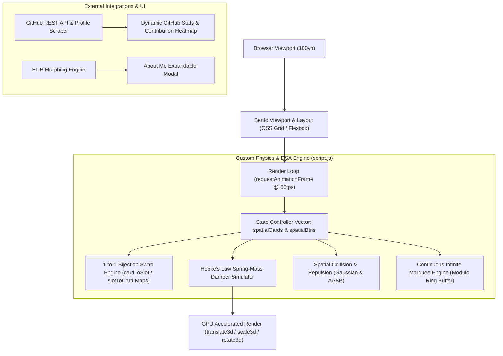

# Architecture & DSA Specifications — Sahilfolio Bento Engine

## Overview
**Sahilfolio** is a high-performance single-screen developer portfolio built with zero framework dependencies (Vanilla HTML5, CSS3, and ES6+ JavaScript). It features a custom physics engine, interactive grid matrix slot swap algorithm, real-time spatial collision detection, FLIP animation pipeline, and live API integrations.

---

## Architecture Diagram & Component Flow



---

## 1. Data Structures Applied

### A. Mathematical Permutation Vector & Slot Matrix Maps ($\mathcal{S}_N$)
* **`virtualOrder` & Permutation Vector ($\pi \in \mathcal{S}_N$)**: Represents the card ordering in a permutation group of degree $N$.
* **Bijection Maps (`cardToSlot` and `slotToCard`)**:
  * `cardToSlot[cardIndex] -> slotIndex`: $\mathbb{N} \to \mathbb{N}$ mapping card index to virtual grid slot.
  * `slotToCard[slotIndex] -> cardIndex`: Inverse bijective mapping back to the assigned card.
  * **Guarantee**: Enforces strict 1-to-1 occupancy—no two cards can occupy the same slot in the matrix grid.

### B. Spatial Index Cache (`spatialCards` and `spatialBtns`)
* **State Vectors**: Flat array of controller objects containing pre-computed bounding boxes (`restLeft`, `restTop`, `width`, `height`), position state vectors ($x, y, z$), velocity vectors ($v_x, v_y, v_{rz}$), and tilt targets.
* **Cache Invalidation**: Recomputed lazily on `resize` and `orientationchange` events to prevent layout thrashing and DOM reads inside the render loop.

### C. Ring Buffer (Modulo Marquee Tracks)
* Linear array of tech stack icon elements duplicated for seamless infinite scrolling.

---

## 2. Algorithms & Mathematical Formulations

### A. Hooke's Law Mass-Spring-Damper Simulation
Each card acts as a physical mass connected to its assigned virtual slot via a spring:

$$F_x = -k_{\text{spring}} \cdot (x - x_{\text{target}}) - (1 - k_{\text{damp}}) \cdot v_x$$
$$F_y = -k_{\text{spring}} \cdot (y - y_{\text{target}}) - (1 - k_{\text{damp}}) \cdot v_y$$

* **Parameters**:
  * $k_{\text{spring}} = 0.16$ (Spring stiffness constant)
  * $k_{\text{damp}} = 0.76$ (Damping ratio for critical damping without overshoot)
  * Rotational spring constants $k_{\text{rotSpring}} = 0.14$, $k_{\text{rotDamp}} = 0.74$.

### B. Symmetrical Directional Projection & Grid Matrix Swap Engine
During active card drag, a real-time intersection metric evaluates target slot candidates:

$$\text{Overlap}_X = \max\left(0, \min(R_{\text{drag}}, R_{\text{slot}}) - \max(L_{\text{drag}}, L_{\text{slot}})\right)$$
$$\text{Metric} = \max\left(\frac{\text{Overlap}_X}{\text{Width}_{\text{slot}}}, \frac{\text{Overlap}_Y}{\text{Height}_{\text{slot}}}\right) \times \text{Scale}$$

* **Condition**: If $\text{Metric} > 0.18$ (18% directional shift across any axis), the engine executes an instant $O(1)$ swap in the bijection maps (`cardToSlot` and `slotToCard`), recalculating target positions for all displaced grid cards.

### C. Gaussian Repulsion Force Field
Non-held cards near a dragged card experience an inverted radial force mimicking physical magnetic repulsion:

$$\text{Intensity} = \left(1 - \frac{d}{\text{Radius}_{\text{repel}}}\right)^2 \quad \text{for } d < \text{Radius}_{\text{repel}}$$
$$\vec{F}_{\text{push}} = \text{Intensity} \cdot 60 \cdot \hat{u}_{d}$$

### D. AABB Penetration & Collision Resolution Solver
Runs an $O(N^2)$ Axis-Aligned Bounding Box (AABB) overlap solver to prevent card clipping:

$$\text{Overlap}_X = \min(A_{\text{right}}, B_{\text{right}}) - \max(A_{\text{left}}, B_{\text{left}}) + \text{Margin}$$
$$\text{Separation Vector } \vec{S} = \begin{cases} (\text{Overlap}_X \cdot \text{sign}_X, 0) & \text{if } \text{Overlap}_X < \text{Overlap}_Y \\ (0, \text{Overlap}_Y \cdot \text{sign}_Y) & \text{otherwise} \end{cases}$$

### E. FLIP Morphing Engine (First, Last, Invert, Play)
Used in `openAboutModal()` and `closeAboutModal()` for 60fps modal expansion:
1. **First**: Record hero card initial bounding rect ($R_{\text{hero}}$).
2. **Last**: Render target modal rect ($R_{\text{modal}}$).
3. **Invert**: Compute translation delta $(\Delta X, \Delta Y)$ and scale ratio $(\sigma_x, \sigma_y)$.
4. **Play**: Apply `transform: translate3d(...) scale(...)` with CSS cubic-bezier transition (`cubic-bezier(0.16, 1, 0.3, 1)`).

### F. Modulo Virtualization for Marquee Track
Continuous smooth continuous infinite scroll:

$$\text{Pos}_{\text{top}} = (\text{Pos}_{\text{top}} - v_{\text{top}}) \pmod{\text{Width}_{\text{half}}}$$
$$\text{Pos}_{\text{bottom}} = -W_{\text{half}} + \left((\text{Pos}_{\text{bottom}} + v_{\text{bottom}}) \pmod{\text{Width}_{\text{half}}}\right)$$

---

## 3. Technology Stack Breakdown

| Layer | Technologies & Tools |
| :--- | :--- |
| **Markup & Structure** | Semantic HTML5, OpenGraph Meta, WAI-ARIA |
| **Styling & Design System** | Vanilla CSS3, Glassmorphism, CSS Custom Variables, CSS Keyframes |
| **Scripting & Engine** | ES6+ JavaScript, Web Haptics API (`navigator.vibrate`), Pointer Events API |
| **Typography & Icons** | Google Fonts (Outfit, Space Grotesk, JetBrains Mono, Patrick Hand), Devicon v2.16, FontAwesome 6 |
| **Live APIs** | GitHub REST API (`/users/KingSahil`, `/users/KingSahil/repos`), AllOrigins CORS Proxy (Contributions Scraper) |

---

## 4. Directory Structure

```
sahilfolio/
├── index.html                  # Single-screen HTML5 bento structure & modal template
├── architecture.md             # System architecture & DSA specifications document
├── assets/
│   ├── css/
│   │   └── styles.css          # Glassmorphism styling, responsive bento grid, animations
│   ├── js/
│   │   └── script.js           # Physics engine, DSA slot swaps, FLIP modal, GitHub API
│   └── resume/
│       └── resume.pdf          # Professional developer resume
```
